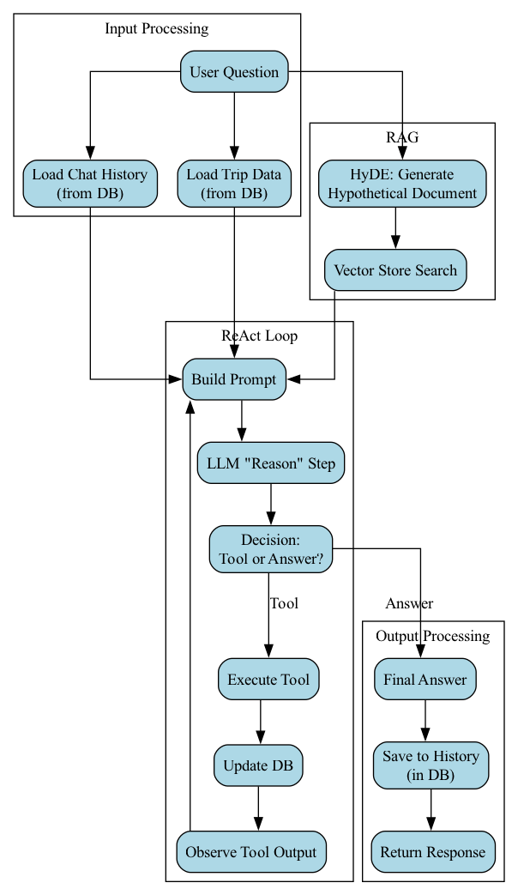
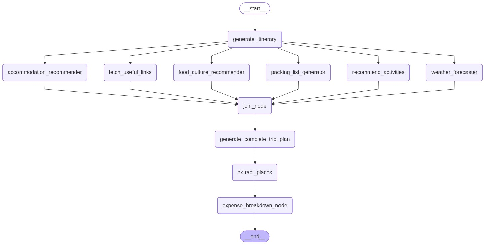

# SafarSmart - AI-Powered Travel Itinerary Planner

SafarSmart is a comprehensive web application designed to revolutionize your travel planning experience with advanced AI capabilities. It allows users to create, manage, and personalize their travel itineraries with ease, offering intelligent suggestions and real-time alerts.

## Features

-   **User Authentication:** Secure registration, login, and password management.
-   **Trip Management:** Create, view, update, and delete your travel plans.
-   **AI-Powered Itinerary Generation:** Leverages Langchain/LangGraph to craft detailed day-by-day itineraries, including dining, activities, and accommodation suggestions.
-   **AI Chatbot with RAG:** An interactive chatbot that uses Retrieval Augmented Generation (RAG) to answer trip-related questions and modify plans.
-   **Weather and News Alerts:** Receive email notifications for severe weather warnings or significant news events affecting your trip destination.
-   **Checkpoint Tracking & Feedback:** Mark itinerary checkpoints as visited and provide feedback for each, with feedback elements freezing after submission.
-   **PDF Download:** Generate and download a PDF version of your complete trip itinerary.
-   **Payment Integration:** Secure payment processing for premium features using Razorpay.
-   **Responsive Design:** A user-friendly interface accessible across various devices.

## AI Agents and LangGraph Integration

SafarSmart leverages the power of **Langchain** and **LangGraph** to provide intelligent, AI-driven trip planning capabilities. The core of this functionality resides in a network of specialized AI agents, each responsible for a distinct aspect of the trip planning process. We utilize **Google Generative AI (Gemini-Pro)** for core language model tasks and **Ollama** for efficient local embeddings, enabling Retrieval Augmented Generation (RAG) for enhanced context.

### How it Works

The AI agents operate within a **LangGraph workflow**, allowing for a structured and sequential execution of tasks to build a comprehensive trip plan. When a user initiates a trip planning request, the system orchestrates the following agents in a defined flow:

1.  **Itinerary Generator (`generate_itinerary`):** Based on user preferences (destination, duration, budget, etc.), this agent crafts a detailed day-by-day itinerary, including dining options and downtime suggestions.

2.  **Accommodation Recommender (`accommodation_recommender_agent`):** This agent searches for and recommends suitable accommodations, providing details like ratings, snippets, and booking links.

3.  **Expense Breakdown Agent (`expense_breakdown_agent`):** It estimates and breaks down the total trip cost into categories such as accommodation, food, activities, and transportation, based on the destination and budget type.

4.  **Complete Trip Plan Synthesizer (`complete_trip_plan_agent`):** This final agent synthesizes all the information generated by the preceding agents (itinerary, accommodation, expenses, activities, weather, etc.) into a single, comprehensive, and visually appealing trip plan. It enriches the plan with local insights, practical advice, and relevant links.

### Other Specialized Agents

In addition to the main workflow, several other agents are available to provide specific information or handle user interactions:

-   **Activity Recommender (`recommend_activities_agent`):** Suggests unique local activities and attractions using external search capabilities.
-   **Useful Links Fetcher (`fetch_useful_links_agent`):** Gathers general travel tips and guides relevant to the destination.
-   **Weather Forecaster (`weather_forecaster_agent`):** Provides detailed weather forecasts and advises travelers based on the destination and month.
-   **Packing List Generator (`packing_list_generator_agent`):** Creates a comprehensive packing list tailored to the holiday type, destination, and expected weather.
-   **Food & Culture Recommender (`food_culture_recommender_agent`):** Recommends popular local dishes, dining options, and provides insights into cultural norms and etiquette.
-   **Chat Agent (`chat_agent`):** Handles general user questions and can modify the complete trip plan based on user requests, providing an interactive conversational experience, powered by RAG for contextual understanding and dynamic plan adjustments.

This modular agent-based architecture ensures that each aspect of trip planning is handled by a specialized AI, leading to highly detailed, accurate, and personalized travel itineraries.

## Payment System

SafarSmart includes a payment system that allows users to add money to their wallets and use it to pay for itinerary generation. The payment system is built using Razorpay.

### Features

-   **Add Money to Wallet:** Users can add money to their wallets using Razorpay.
-   **Pay for Itineraries:** Users can use their wallet balance to pay for itinerary generation after they have exhausted their free quota.
-   **Payment History:** Users can view their payment history on their profile page.

### Implementation Details

-   **Backend:** The payment system is implemented in the `payments` app. It includes models for storing payment information, views for handling payment requests, and URLs for routing payment-related requests.
-   **Frontend:** The payment-related pages are located in the `payments/templates/payments` directory. The user profile page is updated to display the wallet balance and provide an option to add money.
-   **Payment Gateway:** Razorpay is used as the payment gateway. The Razorpay API keys are stored in environment variables.

## Technologies Used

-   **Backend:** Python, Django
-   **Database:** SQLite (default, can be configured for PostgreSQL, MySQL, etc.), ChromaDB (for vector embeddings)
-   **Frontend:** HTML, CSS, JavaScript
-   **AI Integration:** Langchain, LangGraph, Google Generative AI (Gemini-Pro), Ollama (for local embeddings)
-   **External APIs:** NewsData.io (for news alerts), OpenWeatherMap (for weather forecasts)
-   **Payment Gateway:** Razorpay

## Installation

Follow these steps to set up and run SafarSmart on your local machine:

1.  **Clone the Repository:**

    ```bash
    git clone https://github.com/ishant721/SAFAR_SMART.git
    cd SAFAR_SMART
    ```

2.  **Create a Virtual Environment:**

    It's recommended to use a virtual environment to manage project dependencies.

    ```bash
    python3 -m venv venv
    source venv/bin/activate  # On Windows use `venv\Scripts\activate`
    ```


3.  **Install Dependencies:**

    Install all required Python packages using pip:

    ```bash
    pip install -r requirements.txt
    ```

4.  **Environment Variables Setup:**

    Create a `.env` file in the root directory of the project and add the following variables. Replace the placeholder values with your actual API keys and credentials:

    ```
    GOOGLE_API_KEY="your_google_gemini_api_key"
    SERPER_API_KEY="your_google_serper_api_key"
    NEWSDATA_API_KEY="your_newsdata_io_api_key"
    OPENWEATHERMAP_API_KEY="your_openweathermap_api_key"

    # Email Configuration (for sending alerts and OTPs)
    EMAIL_HOST="smtp.gmail.com"
    EMAIL_PORT=587
    EMAIL_USE_TLS=True
    EMAIL_HOST_USER="your_email@example.com"
    EMAIL_HOST_PASSWORD="your_email_app_password"

    # Razorpay Settings
    RAZORPAY_KEY_ID="your_razorpay_key_id"
    RAZORPAY_KEY_SECRET="your_razorpay_key_secret"
    ```

5.  **Ollama Setup (for local embeddings):**

    If you plan to use Ollama for local embeddings (configured in `planner/rag_logic.py`):

    a.  **Download and install Ollama:** Follow the instructions on the official Ollama website: [https://ollama.ai/](https://ollama.ai/)
    b.  **Pull the `llama3` model:** Open your terminal and run:
        ```bash
        ollama pull llama3
        ```

6.  **Database Setup:**

    Apply database migrations to create the necessary tables:

    ```bash
    python manage.py migrate
    ```

5.  **Create a Superuser (Optional, for Admin Access):**

    To access the Django admin panel, create a superuser:

    ```bash
    python manage.py createsuperuser
    ```
    Follow the prompts to set up a username, email, and password.

6.  **Run the Development Server:**

    Start the Django development server:

    ```bash
    python manage.py runserver
    ```

    The application will be accessible at `http://127.0.0.1:8000/`.

## Workflow Diagrams

### Chatbot Workflow



### LangGraph Workflow



## Usage

1.  **Register/Login:** Access the application through your web browser and register a new account or log in if you already have one.
2.  **Create a Trip:** Navigate to the dashboard and start planning your trip by providing destination, dates, and other details.
3.  **Detailed Planning:** Utilize the various sections to add accommodation information, manage expenses, and explore activity suggestions generated by the AI.

## Project Structure

-   `travel_planner/`: The main Django project configuration.
-   `planner/`: Handles core trip planning logic, models, views, and templates.
-   `users/`: Manages user authentication and profiles.
-   `payments/`: Handles payment processing and history.
-   `static/`: Contains static files like CSS, JavaScript, and images.
-   `templates/`: Stores global HTML templates.

## Contributing

Contributions are welcome! If you'd like to contribute, please follow these steps:

1.  Fork the repository.
2.  Create a new branch (`git checkout -b feature/your-feature-name`).
3.  Make your changes.
4.  Commit your changes (`git commit -m 'Add new feature'`).
5.  Push to the branch (`git push origin feature/your-feature-name`).
6.  Open a Pull Request.

